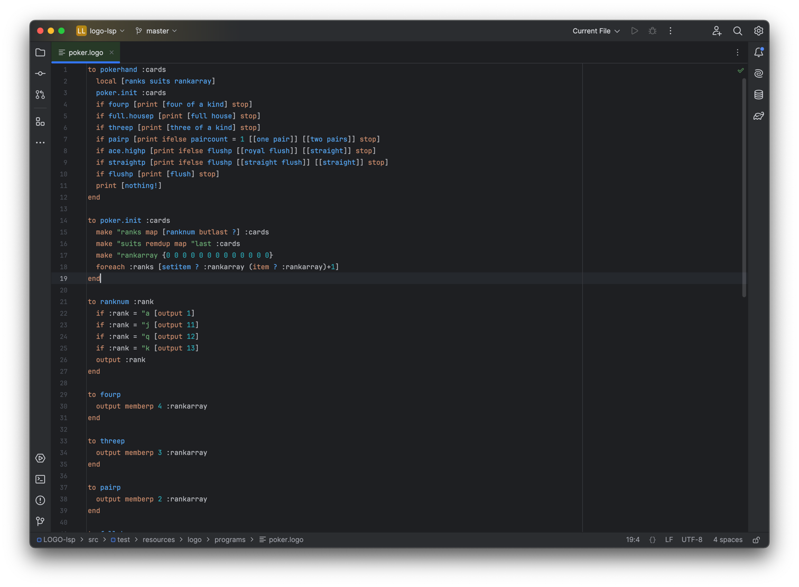
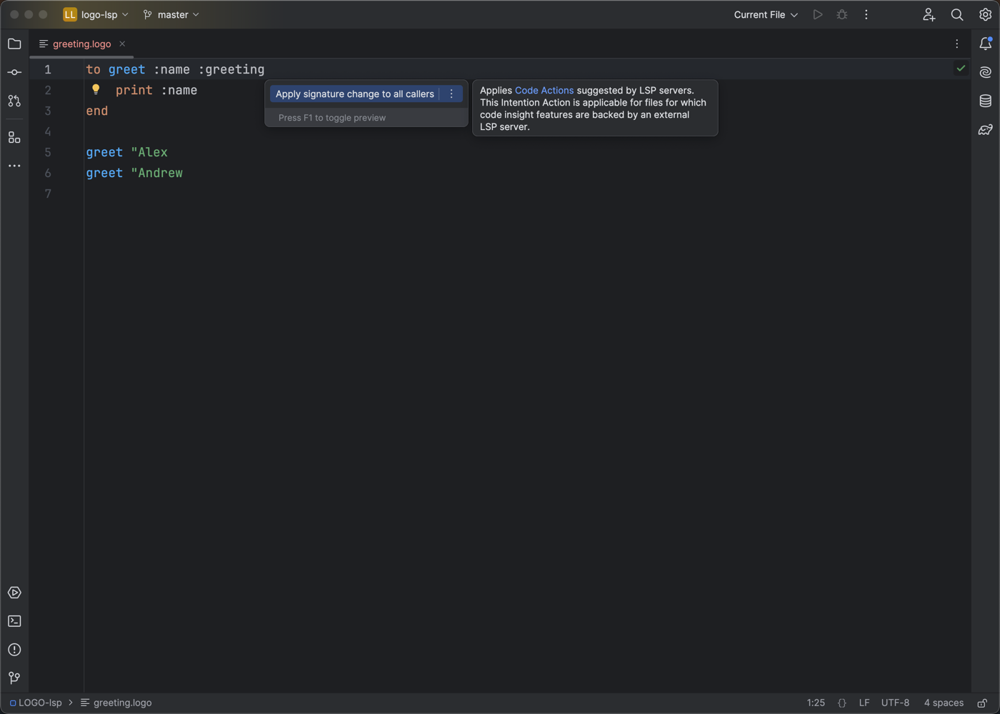

# LOGO Language Support

An IntelliJ plugin that adds language support for [UCBLogo](https://people.eecs.berkeley.edu/~bh/logo.html) via a bundled LSP server written in Kotlin

## Features

| Feature                              | LSP method                                                                     |
|--------------------------------------|--------------------------------------------------------------------------------|
| Syntax highlighting                  | `textDocument/semanticTokens/full`                                             |
| Go-to-declaration / Go-to-definition | `textDocument/declaration` + `textDocument/definition`                         |
| Change Signature                     | `textDocument/codeAction` + `workspace/executeCommand` + `workspace/applyEdit` |

## Running

**Prerequisites:** JDK 21, IntelliJ IDEA Ultimate 2023.2+

```bash
# Launch a sandboxed IntelliJ with the plugin installed
./gradlew runIde

# Run tests
./gradlew test

# Build the distributable plugin ZIP
./gradlew buildPlugin
```

Open any `.logo` file in the sandboxed IDE and the server starts automatically

## Change Signature

> *"One of the limitations of LSP is the inability to show a complex UI on the client side, which is crucial to Change Signature refactoring"*

IntelliJ's native Change Signature opens a dialog for adding, removing, and reordering parameters. The LSP protocol has no equivalent

**The approach here: the source file is the UI**

1. Edit the `TO` header directly to add, remove, or reorder parameters
2. Place the cursor on the `TO` line and invoke **Alt+Enter -> "Apply signature change to all callers"**
3. The server compares the new parameter count against each call site and reconciles them atomically via `workspace/applyEdit`:
   - Too few args → appends `0` placeholder(s)
   - Too many args → removes trailing excess arg(s)

## Screenshots



